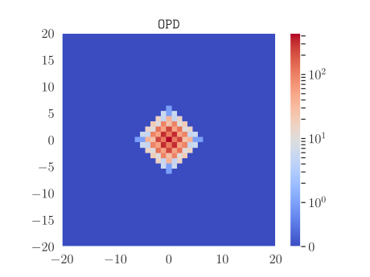
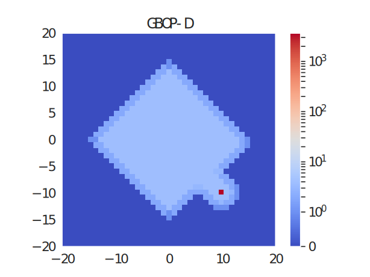
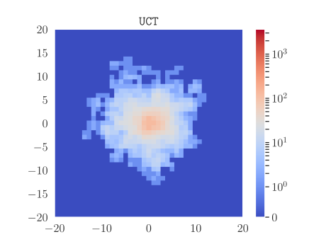
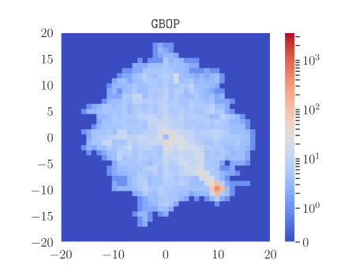
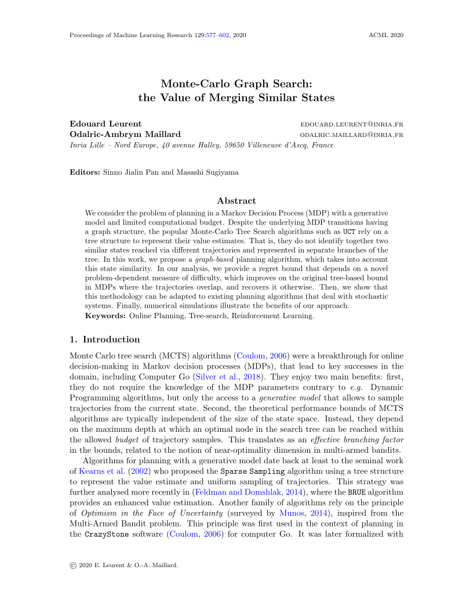

----------------------------
# Videos

<p align="center">
    <video controls width="800" height="400">
        <source src="http://hydro.ijs.si/v01b/f1/6fhpocc2j6ki6hxj76wu5uievfgocqsr.mp4">
    </video>
</p>

-------------------------

# Abstract

We consider the problem of planning in a Markov Decision Process (MDP) with a generative model and limited computational budget. Despite the underlying MDP transitions having a graph structure, the popular Monte-Carlo Tree Search algorithms such as \texttt{UCT} rely on a tree structure to represent their value estimates. That is, they do not identify together two similar states reached via different trajectories and represented in separate branches of the tree. In this work, we propose a \emph{graph-based} planning algorithm, which takes into account this state similarity. In our analysis, we provide a regret bound that depends on a novel problem-dependent measure of difficulty, which improves on the original tree-based bound in MDPs where the trajectories overlap, and recovers it otherwise. Then, we show that this methodology can be adapted to existing planning algorithms that deal with stochastic systems. Finally, numerical simulations illustrate the benefits of our approach.

----------------------------

# Paper and Bibtex

<div style="display: flex;">
<div style="flex: 0 0 15em;">
	<a href="{{ site.paper_url }}">
		
		<br>
		<h2>[Paper]</h2>
	</a>
</div>
<div style="flex: auto" markdown="1">

## Citation

Leurent, E. and Maillard, O-A., 2020.<br>
*Monte-Carlo Graph Search: the Value of Merging Similar States.* In Asian Conference on Machine Learning.

## [[Bibtex]]()

```
@inproceedings{Leurent2020monte,
    title={Monte-Carlo Graph Search: the Value of Merging Similar States},
    author={Edouard Leurent and Odalric-Ambrym Maillard},
    editor={Sinno Jialin Pan and Masashi Sugiyama},
    booktitle={Asian Conference on Machine Learning (ACML 2020)},
    address={Bangkok, Thailand},
    month={November 18-20},
    pages = {577 - 592},
    year={2020},
}
```
</div>
</div>
